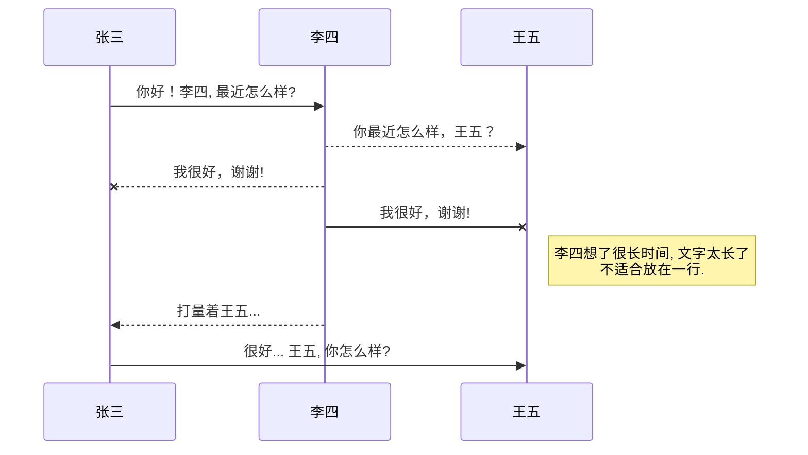

# God-help-those-who-help-themselves
some interesting demos

1.标题
# 一级标题
## 二级标题
### 三级标题
#### 四级标题
##### 五级标题
###### 六级标题

2.粗体斜体
**粗体**
*斜体*
***加粗斜体***

3.链接

[baidu](https://www.baidu.com)

4.图片


5.代码块
···
这是一段代码
这是一段代码
这是一段代码
···

6.表
|列名1|列名2|
|:---|:---|
|列1的内容1|列2的内容1|
|列1的内容2|列2的内容2|

7.列表
- 项目
  - 项目
    - 项目

1. 项目1
2. 项目2
3. 项目3

- [ ] 计划任务
- [x] 完成任务

8.uml图表渲染

9.流程图
```mermaid
flowchat
st=>start: 开始
e=>end: 结束
op=>operation: 我的操作
cond=>condition: 确认？

st->op->cond
cond(yes)->e
cond(no)->op
```

10.导入
 [1]: https://www.baidu.com
